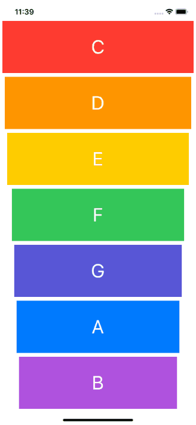

# Xylophone

## Goal

This is a test app that was created during App Development Bootcamp. The main goal of this app is to understand of how easily you can play sound inside your app and use an Apple library called AVFoundation. I did that by exploring StackOverflow, Apple Documentation and learned how to search. 

## Key elements

* How to play sound using AVFoundation and AVAudioPlayer.
* Functions and methods in Swift. 
* Data types.
* Swift loops.
* Variable scope.
* The ViewController lifecycle.
* Error handling in Swift.

  

